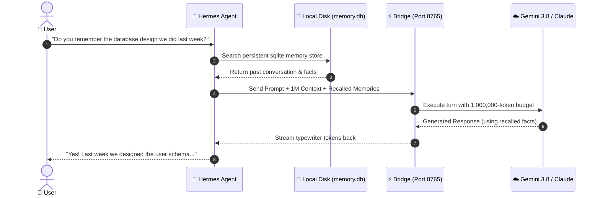

# Hermes Antigravity Bridge

<p align="center">
  <a href="https://pypi.org/project/hermes-antigravity-bridge/"></a>
  <a href="https://github.com/usright003-cmyk/hermes-antigravity-bridge/actions"></a>
  
  
  
  
  <a href="LICENSE"></a>
</p>

<p align="center">
  
</p>

<h3 align="center">Unleash Google Antigravity into your Hermes Agent with a native 1 Million token context window, real-time token typewriter streaming, and zero cloud API fees.</h3>

---

## 📐 Visual System Architecture & Memory Flow

<p align="center">
  
</p>

---

## ⚡ Key Capabilities

* 🧠 **1,000,000-Token Native Context**: Massive 4,000,000-character prompt budget for large codebases, research papers, and deep conversational history without premature truncation.
* ⚡ **Real-Time Token Streaming**: Subprocess `stream-json` bridge delivering low-latency Server-Sent Events (SSE) with instantaneous typewriter fluidity.
* 🤖 **Multi-Model Catalog with Effort Control**: Native support and granular reasoning effort mapping (`low`, `medium`, `high`) for **Gemini 3.8/3.7/3.6 Flash**, **Gemini 3.1 Pro**, **Claude Sonnet 4.6 (Thinking)**, **Claude Opus 4.6 (Thinking)**, and **GPT-OSS 120B**.
* 🛡️ **Hermes Cognitive Sovereignty**: Hermes is the sole, undisputed owner of `USER.md`, `MEMORY.md`, SQLite memory databases, and tool execution. Antigravity runs purely as an isolated, stateless reasoning engine.
* 🔒 **Fail-Closed Sandbox Gate**: Antigravity is strictly prevented from executing autonomous host commands (`--sandbox`, `--mode plan`, `toolPermission: strict`, ephemeral isolated working directories).
* 🔄 **Multi-Provider Coexistence**: Preserves existing providers (OpenAI, Anthropic, Groq, Ollama) in your Hermes configuration—switch anytime with `/model`!
* 📦 **Zero External Dependencies**: Pure Python standard library (`http.server`, `subprocess`, `dataclasses`, `json`). Lightweight, auditable, and zero dependency drift.
* 📊 **Embedded Observability Dashboard**: Built-in glassmorphic web interface (`http://localhost:8765/dashboard`) and `/api/metrics` with zero external CDNs or frameworks.
* 🌍 **Cross-Platform**: Verified and tested across Linux, macOS, Windows, and Android (Termux).

---

## 🤖 Supported Models & Reasoning Effort Levels

All models are dynamically available over `/v1/models` and compatible with Hermes's interactive `/model` picker:

| Model Family | Model Name / ID | Effort Levels | Context Window | Best For |
| :--- | :--- | :---: | :---: | :--- |
| **Google Gemini** | `gemini-3.8-flash` | `low`, `medium`, `high` | **1,000,000 tokens** | Ultra-fast agentic coding & default workhorse |
| **Google Gemini** | `gemini-3.7-flash` | `low`, `medium`, `high` | **1,000,000 tokens** | Balanced reasoning and quick turnarounds |
| **Google Gemini** | `gemini-3.6-flash` | `low`, `medium`, `high` | **1,000,000 tokens** | Lightweight conversational workflows |
| **Google Gemini** | `gemini-3.1-pro` | `low`, `medium`, `high` | **1,000,000 tokens** | Complex architectural planning & deep logic |
| **Anthropic Claude** | `claude-sonnet-4-6` | *Native Thinking* | **200,000 tokens** | High-accuracy coding, refactoring & deep analysis |
| **Anthropic Claude** | `claude-opus-4-6` | *Native Thinking* | **200,000 tokens** | Deep reasoning and difficult creative tasks |
| **OpenAI / Open** | `gpt-oss-120b` | *Standard* | **128,000 tokens** | Open-weights algorithmic execution |

> **Effort Flag Mapping:** Specifying `gemini-3.8-flash-low`, `gemini-3.8-flash-medium`, or `gemini-3.8-flash-high` automatically maps to Antigravity's native `--effort` flag. Base model selections automatically adopt the request's `reasoning_effort` parameter (defaulting to `medium`).

---

## 🚀 Quick Start Guide

### Option 1: One-Click Windows Automated Setup (Fastest)

Open PowerShell and run this single line:

```powershell
irm https://raw.githubusercontent.com/usright003-cmyk/hermes-antigravity-bridge/main/install.ps1 | iex
```

This automatically:
1. Clones the repository to your user directory.
2. Checks/prompts for your Google Antigravity sign-in if needed.
3. Automatically connects Antigravity to Hermes Agent while preserving your existing providers.
4. Creates a convenient **`Run-Antigravity-Bridge.bat`** launcher directly on your **Desktop**.

---

### Option 2: Python / Pip Standard (All Platforms)

```bash
# 1. Install via pip
pip install hermes-antigravity-bridge

# 2. Check configuration and discovered models
hermes-antigravity-bridge check
hermes-antigravity-bridge models

# 3. Start the bridge server
hermes-antigravity-bridge serve
```

---

### Option 3: From Git Source

```bash
# 1. Clone repository
git clone https://github.com/usright003-cmyk/hermes-antigravity-bridge.git
cd hermes-antigravity-bridge

# 2. Automatic One-Click Connection to Hermes
python connect_hermes.py

# 3. Start Bridge Server
run-bridge.bat   # on Windows
# or: python -m hermes_antigravity_bridge.cli serve
```

---

## 📱 Android & Termux Support: Pocket Superintelligence

Run Hermes Agent directly on your Android phone using **Termux** while drawing upon the massive 1,000,000-token DeepMind Gemini 3.8 Flash model hosted on your PC, server, or cloud machine!

<p align="center">
  
</p>

### Why Run on Android with Termux?
* 🔋 **Zero Phone Battery Drain**: Heavy AI inference happens on your PC/server. Your phone stays completely cool and uses almost zero battery.
* 🛠️ **Native Android Superpowers (`termux-api`)**: Hermes running in Termux can trigger phone vibrations, check battery percentage, read/send SMS, fetch device location, and run Android shell scripts.
* 💾 **Local SQLite Memory on Device**: Your personal conversations and preferences (`memory.db`) stay securely stored in your phone's Termux storage.
* 🌐 **Anywhere in the World**: Connect over your local home Wi-Fi or across the globe using [Tailscale](https://tailscale.com/) mesh VPN (no port forwarding required).

### 🚀 1-Click Termux Setup (2 Easy Steps)

#### Step 1: On Your PC / Server (Enable LAN/Mobile Mode)
Double click **`Run-Antigravity-Bridge-LAN.bat`** (or run `run-bridge-lan.bat`).
> This launches the bridge bound to `0.0.0.0:8765` so devices on your Wi-Fi or Tailscale network can connect securely using your 256-bit Bearer Token.

#### Step 2: On Your Android Phone (Termux)
Open the **Termux** app and paste this single command:
```bash
pkg update -y && pkg install -y python git curl
curl -sSL https://raw.githubusercontent.com/usright003-cmyk/hermes-antigravity-bridge/main/setup-termux.sh | bash
```
*Enter your PC's IP (e.g. `http://192.168.0.5:8765/v1`) and Token when prompted.*

#### Step 3: Chat with Hermes!
```bash
hermes
```

> 💡 **Termux Hardware Integration:** Install the Termux:API app from [F-Droid](https://f-droid.org/packages/com.termux.api/) and run `pkg install termux-api` in Termux. Hermes can then run Android hardware tools autonomously!

---

## 🧠 Memory & Skills: How It Works

A common question is: *If I use Google's Antigravity models, how does Hermes retain memory over weeks or months?*



1. **Persistent Memory Ownership**: Hermes maintains your memories, user profile (`USER.md`), and session history on your local machine (`memory.db`). They are never lost when changing models.
2. **Infinite Recall**: Thanks to the **1,000,000 token context window**, Hermes can load expansive memory files, past code snapshots, and active skills without running out of tokens or suffering context degradation.
3. **Skill & Tool Execution**: When the model suggests a tool call (e.g. searching the web, executing code, or modifying memory), the bridge hands control back to Hermes. Hermes executes the skill locally under strict safety guidelines.

---

## 🔄 Switching Models in Hermes

Because the bridge registers as a standard custom provider, switching models in Hermes is instantaneous:

1. In any active Hermes chat session, type:
   ```text
   /model
   ```
2. Use the arrow keys to choose between your existing providers (OpenAI, Groq, Anthropic) or any Antigravity model:
   - `gemini-3.8-flash-high`
   - `gemini-3.1-pro-high`
   - `claude-sonnet-4-6`
   - `gpt-oss-120b`

Or launch Hermes directly with your preferred model:
```bash
hermes --model gemini-3.8-flash-high
```

---

## 🖥️ Built-in Observability Dashboard

Once the bridge is running, navigate to `http://localhost:8765/dashboard` in your browser for an embedded, zero-dependency diagnostic console:

* 🟢 **Live Status & Uptime**: Real-time service heartbeat and health monitoring.
* 🤖 **Model Catalog**: Live status of all 14 Antigravity model variants.
* 📈 **Telemetry Counters**: Request counts, active SSE streams, and token throughput.
* 🛡️ **Isolation Verification**: Visual verification of `--sandbox`, `--mode plan`, and 1M prompt budgeting.

---

## 🛡️ Security Gate & Tool Isolation

Antigravity CLI is an autonomous agent runtime by design. Running in `--mode plan` alone is insufficient to prevent tool execution if global user settings permit it. This bridge enforces deep isolation:

* **Dedicated Antigravity `HOME`**: Completely isolated from user `~/.gemini` settings.
* **Strict Permission Verification**: Enforces `toolPermission: strict`, zero permission allow rules, no trusted workspaces, and no `always-proceed` artifact policy.
* **Sandboxed Execution**: Calls CLI with `--sandbox` and `--mode plan`.
* **Ephemeral Temp Directories**: A clean, empty working directory is provisioned for every single turn.
* **Fail-Closed Stream Monitor**: Aborts immediately if the stream output indicates internal tool invocations.

See [SECURITY.md](SECURITY.md) and [docs/security-and-privacy.md](docs/security-and-privacy.md).

---

## 🧪 Verification & Testing

```bash
# Run full test suite (47/47 passing)
uv run --with pytest --with pytest-cov pytest

# Verify bytecode compilation
python -m compileall -q src tests
```

---

## 📄 License & Disclaimer

* **License**: [MIT](LICENSE)
* **Non-affiliation**: This is an independent open-source project and is not affiliated with or endorsed by Google, DeepMind, Anthropic, or Nous Research.
