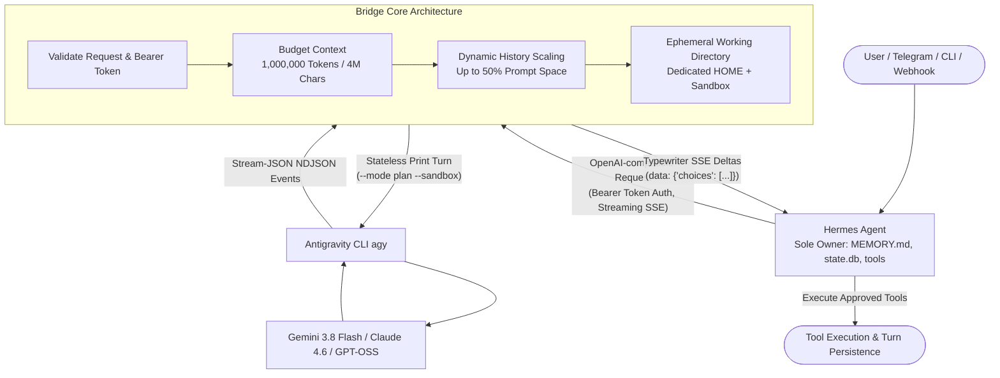

# Hermes Antigravity Bridge

<p align="center">
  <a href="https://pypi.org/project/hermes-antigravity-bridge/"></a>
  <a href="https://github.com/usright003-cmyk/hermes-antigravity-bridge/actions"></a>
  
  
  
  
  <a href="LICENSE"></a>
</p>

<p align="center">
  
</p>

<h3 align="center">Unleash Google Antigravity into your Hermes Agent with a native 1 Million token context window, real-time token typewriter streaming, and zero cloud API fees.</h3>

---

## ⚡ Key Capabilities

* 🧠 **1,000,000-Token Native Context**: Full 4,000,000-character prompt budget for massive multi-file codebases, deep research docs, and long conversational histories without premature truncation.
* ⚡ **Real-Time Token Streaming**: Subprocess `stream-json` bridge delivering low-latency Server-Sent Events (SSE) with instantaneous typewriter fluidity.
* 🤖 **Multi-Model Catalog**: Native support and intelligent aliasing for all models in Google Antigravity: **Gemini 3.8/3.7/3.6 Flash**, **Gemini 3.1 Pro**, **Claude Sonnet 4.6 (Thinking)**, **Claude Opus 4.6 (Thinking)**, and **GPT-OSS 120B**.
* 🛡️ **Hermes Cognitive Sovereignty**: Hermes is the sole owner of `USER.md`, `MEMORY.md`, session history, and tool execution. Antigravity runs as a strictly isolated, stateless reasoning engine.
* 🔒 **Fail-Closed Sandbox Gate**: Antigravity is strictly prevented from executing autonomous host commands (`--sandbox`, `--mode plan`, `toolPermission: strict`, ephemeral directories).
* 📦 **Zero External Dependencies**: Pure Python standard library (`http.server`, `subprocess`, `dataclasses`, `json`). Lightweight, auditable, and zero dependency drift.
* 📊 **Embedded Observability Dashboard**: Built-in glassmorphic web interface (`http://localhost:8765/dashboard`) and `/api/metrics` with zero external CDNs or frameworks.
* 🌍 **Cross-Platform**: Fully tested and verified across Linux, macOS, and Windows.

---

## 🤖 Supported Models & Context Limits

| Model Family | Model Name / ID | Friendly Aliases | Context Window | Best For |
| :--- | :--- | :--- | :---: | :--- |
| **Google Gemini** | `gemini-3.8-flash-high` | `gemini-3.8-flash`, `flash`, `antigravity-flash` | **1,000,000 tokens** | Ultra-fast agentic coding & default workhorse |
| **Google Gemini** | `gemini-3.7-flash` | `gemini-3.7-flash-medium` | **1,000,000 tokens** | Balanced reasoning and quick turnarounds |
| **Google Gemini** | `gemini-3.6-flash` | `gemini-3.6-flash-medium` | **1,000,000 tokens** | Lightweight conversational workflows |
| **Google Gemini** | `gemini-3.1-pro-high` | `gemini-3.1-pro`, `pro`, `antigravity-pro` | **1,000,000 tokens** | Complex architectural planning & deep logic |
| **Anthropic Claude** | `claude-sonnet-4-6` | `claude-sonnet-4.6`, `claude-sonnet` | **200,000 tokens** | Thinking mode, high-accuracy coding & refactoring |
| **Anthropic Claude** | `claude-opus-4-6` | `claude-opus-4.6`, `claude-opus` | **200,000 tokens** | Deep reasoning and difficult creative tasks |
| **OpenAI / Open** | `gpt-oss-120b` | `gpt-oss`, `gpt-oss-120b-medium` | **128,000 tokens** | Open-weights algorithmic execution |

---

## 📐 Architecture & Flow



---

## 🚀 60-Second Quick Start

### Option A: Install via pip (Recommended)

```bash
# 1. Install globally or in your virtual environment
pip install hermes-antigravity-bridge

# 2. Check installation and discovered models
hermes-antigravity-bridge check
hermes-antigravity-bridge models

# 3. Start the bridge server
hermes-antigravity-bridge serve
```

### Option B: Local Python from Source (Linux / macOS / Windows)

```bash
# 1. Clone repository
git clone https://github.com/usright003-cmyk/hermes-antigravity-bridge.git
cd hermes-antigravity-bridge

# 2. Install package in editable mode
pip install -e .

# 3. Check configuration and discovered models
hermes-antigravity-bridge --config config/config.example.toml check
hermes-antigravity-bridge --config config/config.example.toml models

# 4. Start the bridge server
hermes-antigravity-bridge --config config/config.example.toml serve
```

### Option C: Production Linux Service (Managed systemd)

Prepare the isolated environment:
```bash
./scripts/install.sh --prepare
```

Authenticate your dedicated Antigravity home once:
```bash
HOME="$HOME/.local/state/hermes-antigravity-bridge/agy-home" agy
```

Install and start the managed systemd user service:
```bash
./scripts/install.sh
```

---

### 🖥️ Built-in Observability Dashboard

Once the bridge is running, open `http://localhost:8765/dashboard` in your web browser for an embedded, zero-dependency diagnostic dashboard:
- 🟢 **Live Status & Uptime**: Real-time service heartbeat and health status
- 🤖 **Discovered Models**: Automatic listing of available Antigravity models (Gemini 3.8/3.7/3.6, Claude 4.6, GPT-OSS)
- 📈 **Telemetry Counters**: Tracks total requests, streaming SSE sessions, and token throughput
- 🛡️ **Sovereignty & Isolation Indicators**: Verifies `--sandbox`, `--mode plan`, and 1M prompt budget enforcement

---

### 💡 Why Native Host Execution (No Docker)?

The Google DeepMind Antigravity CLI (`agy`) is a proprietary host-installed native binary tied directly to your authenticated Google user profile (`~/.gemini`). Running inside an arbitrary container fails because the container does not contain `agy` or its authentication tokens, leading to immediate backend errors.

This bridge is deliberately engineered with **zero third-party dependencies** using standard Python (`http.server`, `subprocess`, `dataclasses`), providing high-performance, zero-overhead execution directly on your host machine (Linux, macOS, or Windows) with strict isolation gates (`--sandbox`, `--mode plan`, dedicated home).

---

## 🔗 Connecting to Hermes Agent

In your Hermes environment, configure the custom OpenAI-compatible provider:

```bash
# Point Hermes to your local bridge
hermes config set model.provider custom
hermes config set model.base_url http://127.0.0.1:8765/v1
hermes config set model.api_key "$(cat ~/.config/hermes-antigravity-bridge/bridge.token)"

# Select default model
hermes config set model.name "gemini-3.8-flash-high"
```

---

## 🛡️ Security Gate & Tool Isolation

Antigravity CLI is an autonomous agent runtime by design. Running in `--mode plan` alone is insufficient to prevent tool execution if global user settings permit it. This bridge enforces deep isolation:

- **Dedicated Antigravity `HOME`**: Completely isolated from user `~/.gemini` settings.
- **Strict Permission Verification**: Enforces `toolPermission: strict`, zero permission allow rules, no trusted workspaces, and no `always-proceed` artifact policy.
- **Sandboxed Execution**: Calls CLI with `--sandbox` and `--mode plan`.
- **Ephemeral Temp Directories**: A clean, empty working directory is provisioned for every single turn.
- **Fail-Closed Stream Monitor**: Aborts immediately if the stream output indicates internal tool invocations.
- **Strict CLI Version Verification**: Verifies `agy` against validated version signatures. If running a newer or unvalidated CLI version, pass `allow_unvalidated_versions = true` in config to explicitly acknowledge potential protocol differences.

See [SECURITY.md](SECURITY.md) and [docs/security-and-privacy.md](docs/security-and-privacy.md).

---

## 📋 API Endpoints

| Method | Endpoint | Auth | Purpose |
| :--- | :--- | :---: | :--- |
| `GET` | `/health` | No | Basic process liveness probe |
| `GET` | `/ready` | Yes | Validates CLI isolation, flags, and model discovery |
| `GET` | `/v1/models` | Yes | Lists available models discovered from `agy` |
| `GET` | `/v1/models/{id}` | Yes | Retrieves model metadata |
| `POST` | `/v1/chat/completions` | Yes | OpenAI-compatible Chat Completions |
| `GET` | `/version`, `/api/tags` | Yes | Hermes discovery compatibility probes |

See [docs/api-contract.md](docs/api-contract.md) for full contract specifications.

---

## 🧪 Testing

```bash
# Run unit tests
PYTHONPATH=src python3 -m unittest discover -s tests -v

# Validate shell scripts (Linux/macOS)
bash -n scripts/*.sh

# Verify bytecode compilation
python3 -m compileall -q src tests
```

---

## 📄 License & Disclaimer

- **License**: [MIT](LICENSE)
- **Non-affiliation**: This is an independent open-source project and is not affiliated with or endorsed by Google, Antigravity, Anthropic, or Nous Research.
