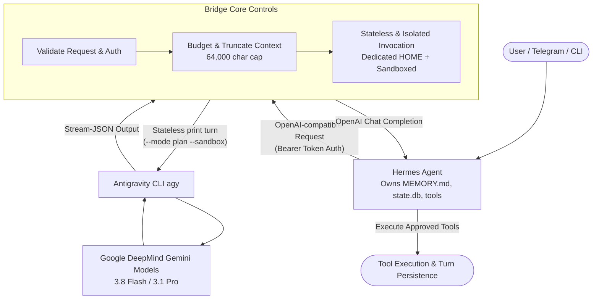

# Hermes Antigravity Bridge

<p align="center">
  <a href="https://github.com/usright003-cmyk/hermes-antigravity-bridge/actions"></a>
  
  
  
  
</p>

A local, authenticated compatibility bridge that lets **Hermes Agent** use advanced models (e.g. Gemini 3.8 Flash, Gemini 3.1 Pro) exposed by the **Google DeepMind Antigravity CLI (`agy`)** via an OpenAI-compatible HTTP interface — while Hermes remains the strict single source of truth for memories, sessions, skills, tools, and continuity.

---

## ⚡ Highlights

- **Zero Cloud API Costs**: Access state-of-the-art models via your local, authenticated `agy` CLI session.
- **Hermes Owns Everything**: Hermes retains full ownership of `USER.md`, `MEMORY.md`, tool execution, skills, and conversation continuity.
- **Fail-Closed Sandbox Gate**: Antigravity is strictly prevented from executing autonomous internal tools (`--sandbox`, `--mode plan`, `toolPermission: strict`, no allow rules, isolated dedicated home).
- **Zero Third-Party Dependencies**: Built entirely on standard Python (`http.server`, `subprocess`, `dataclasses`, `json`).
- **Cross-Platform**: Tested on Linux (systemd & containers), macOS, and Windows.

---

## 📐 Architecture & Flow



---

## 🚀 60-Second Quick Start

### Option A: Local Python (Linux / macOS / Windows)

```bash
# 1. Clone repository
git clone https://github.com/usright003-cmyk/hermes-antigravity-bridge.git
cd hermes-antigravity-bridge

# 2. Install package in editable mode
pip install -e .

# 3. Check configuration and discovered models
hermes-antigravity-bridge --config config/config.example.toml check
hermes-antigravity-bridge --config config/config.example.toml models

# 4. Start the bridge server
hermes-antigravity-bridge --config config/config.example.toml serve
```

### Option B: Docker Compose

```bash
docker compose up -d
```

### Option C: Production Linux Service (Managed systemd)

Prepare the isolated environment:
```bash
./scripts/install.sh --prepare
```

Authenticate your dedicated Antigravity home once:
```bash
HOME="$HOME/.local/state/hermes-antigravity-bridge/agy-home" agy
```

Install and start the managed systemd user service:
```bash
./scripts/install.sh
```

---

## 🔗 Connecting to Hermes Agent

In your Hermes environment, configure the custom OpenAI-compatible provider:

```bash
# Point Hermes to your local bridge
hermes config set model.provider custom
hermes config set model.base_url http://127.0.0.1:8765/v1
hermes config set model.api_key "$(cat ~/.config/hermes-antigravity-bridge/bridge.token)"

# Select default model
hermes config set model.name "gemini-3.8-flash-high"
```

---

## 🛡️ Security Gate & Tool Isolation

Antigravity CLI is an autonomous agent runtime by design. Running in `--mode plan` alone is insufficient to prevent tool execution if global user settings permit it. This bridge enforces deep isolation:

- **Dedicated Antigravity `HOME`**: Completely isolated from user `~/.gemini` settings.
- **Strict Permission Verification**: Enforces `toolPermission: strict`, zero permission allow rules, no trusted workspaces, and no `always-proceed` artifact policy.
- **Sandboxed Execution**: Calls CLI with `--sandbox` and `--mode plan`.
- **Ephemeral Temp Directories**: A clean, empty working directory is provisioned for every single turn.
- **Fail-Closed Stream Monitor**: Aborts immediately if the stream output indicates internal tool invocations.

See [SECURITY.md](SECURITY.md) and [docs/security-and-privacy.md](docs/security-and-privacy.md).

---

## 📋 API Endpoints

| Method | Endpoint | Auth | Purpose |
| :--- | :--- | :---: | :--- |
| `GET` | `/health` | No | Basic process liveness probe |
| `GET` | `/ready` | Yes | Validates CLI isolation, flags, and model discovery |
| `GET` | `/v1/models` | Yes | Lists available models discovered from `agy` |
| `GET` | `/v1/models/{id}` | Yes | Retrieves model metadata |
| `POST` | `/v1/chat/completions` | Yes | OpenAI-compatible Chat Completions |
| `GET` | `/version`, `/api/tags` | Yes | Hermes discovery compatibility probes |

See [docs/api-contract.md](docs/api-contract.md) for full contract specifications.

---

## 🧪 Testing

```bash
# Run unit tests
PYTHONPATH=src python3 -m unittest discover -s tests -v

# Validate shell scripts (Linux/macOS)
bash -n scripts/*.sh

# Verify bytecode compilation
python3 -m compileall -q src tests
```

---

## 📄 License & Disclaimer

- **License**: [MIT](LICENSE)
- **Non-affiliation**: This is an independent open-source project and is not affiliated with or endorsed by Google, Antigravity, Anthropic, or Nous Research.
