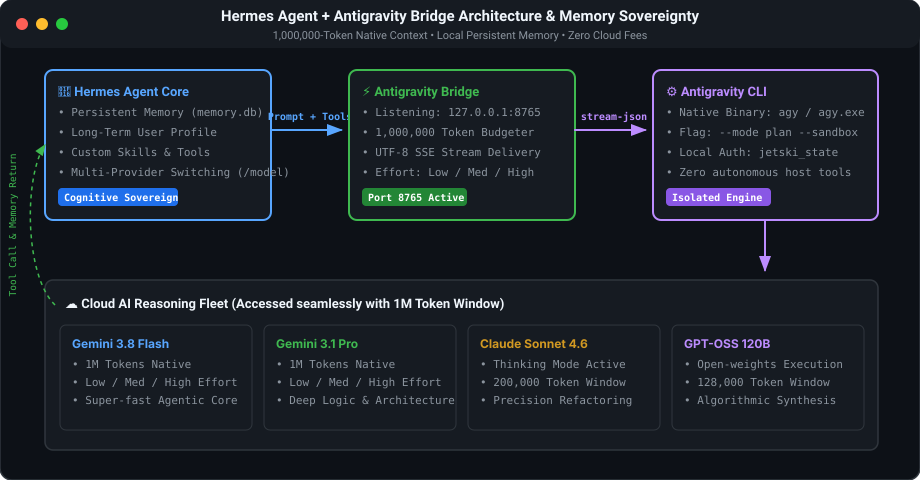
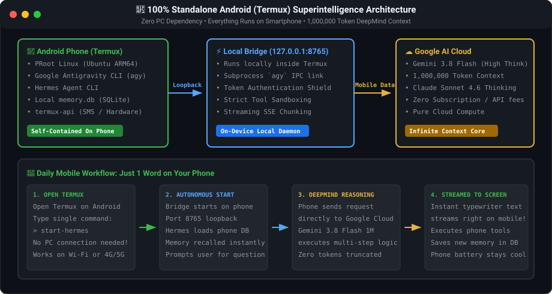
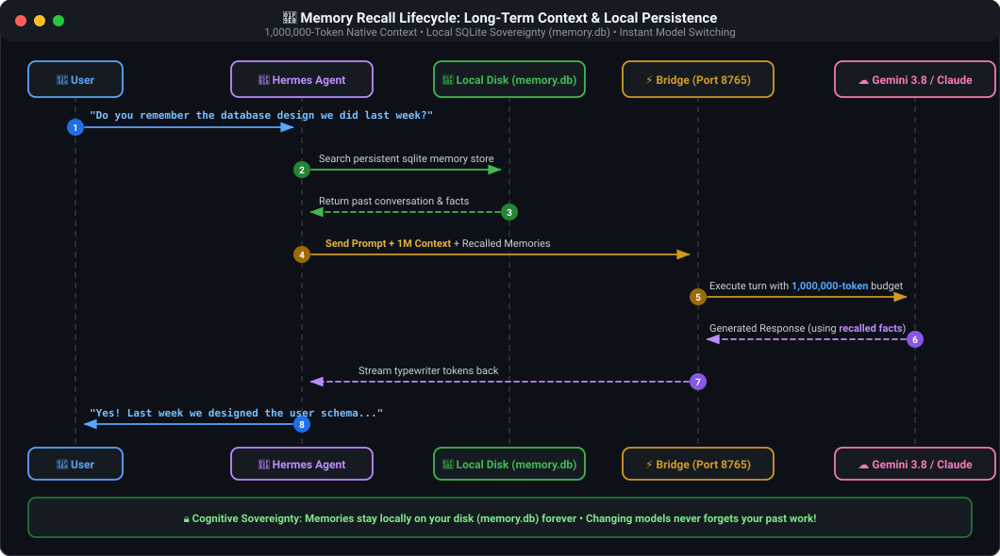

# Hermes Antigravity Bridge

<p align="center">
  <a href="https://pypi.org/project/hermes-antigravity-bridge/"></a>
  <a href="https://github.com/usright003-cmyk/hermes-antigravity-bridge/actions"></a>
  
  
  
  
  <a href="LICENSE"></a>
</p>

<p align="center">
  
</p>

<h3 align="center">Unleash Google Antigravity into your Hermes Agent with a native 1 Million token context window, real-time token typewriter streaming, and zero cloud API fees.</h3>

---

## 📐 Visual System Architecture & Memory Flow

<p align="center">
  
</p>

---

## ⚡ Key Capabilities

* 🧠 **1,000,000-Token Native Context**: Massive 4,000,000-character prompt budget for large codebases, research papers, and deep conversational history without premature truncation.
* ⚡ **Real-Time Token Streaming**: Subprocess `stream-json` bridge delivering low-latency Server-Sent Events (SSE) with instantaneous typewriter fluidity.
* 🤖 **Multi-Model Catalog with Effort Control**: Native support and granular reasoning effort mapping (`low`, `medium`, `high`) for **Gemini 3.8/3.7/3.6 Flash**, **Gemini 3.1 Pro**, **Claude Sonnet 4.6 (Thinking)**, **Claude Opus 4.6 (Thinking)**, and **GPT-OSS 120B**.
* 🔄 **Universal Multi-Persona Support**: Non-destructively preserves existing providers (OpenAI, Anthropic Claude, Groq, Ollama) as `fallback_providers`—switch anytime with `/model`! Existing `agy` users connect in 1 second; new users get complete zero-friction defaults.
* 🔑 **Dual-Mode Flexible Authentication**: Auto-launches default browser for Google OAuth sign-in on desktop, with seamless headless terminal fallback (prints OAuth link & accepts verification code) for remote SSH, headless VPS, and Android Termux.
* 🛠️ **Automatic Prerequisite Discovery**: 1-click installer automatically detects and installs Google Antigravity CLI (`agy`) via Google's official installer and installs/updates `hermes-agent` if missing.
* 🪟 **Zero-Black-Window Silent Background Launcher**: Run the bridge in the background without terminal clutter or intrusive popup console windows via `Run-Antigravity-Bridge-Background.vbs`.
* 📱 **Android & Termux Pocket Superintelligence**: 100% standalone PRoot Linux execution, pure-Python YAML fallback engine (zero dependency on C compilers), and `/ready` bearer-authenticated health monitoring.
* 🛡️ **Hermes Cognitive Sovereignty & Fail-Closed Isolation**: Hermes is the sole, undisputed owner of `USER.md`, `MEMORY.md`, SQLite memory databases, and tool execution. Antigravity runs purely as an isolated, stateless reasoning engine (`--sandbox`, `--mode plan`, `toolPermission: strict`).
* 📊 **Embedded Observability Dashboard**: Built-in glassmorphic web interface (`http://localhost:8765/dashboard`) and `/api/metrics` with zero external CDNs or frameworks.
* 🌍 **Cross-Platform**: Verified and tested across Linux, macOS, Windows, and Android (Termux).

---

## 🤖 Supported Models & Reasoning Effort Levels

All models are dynamically available over `/v1/models` and compatible with Hermes's interactive `/model` picker:

| Model Family | Model Name / ID | Effort Levels | Context Window | Best For |
| :--- | :--- | :---: | :---: | :--- |
| **Google Gemini** | `gemini-3.8-flash` | `low`, `medium`, `high` | **1,000,000 tokens** | Ultra-fast agentic coding & default workhorse |
| **Google Gemini** | `gemini-3.7-flash` | `low`, `medium`, `high` | **1,000,000 tokens** | Balanced reasoning and quick turnarounds |
| **Google Gemini** | `gemini-3.6-flash` | `low`, `medium`, `high` | **1,000,000 tokens** | Lightweight conversational workflows |
| **Google Gemini** | `gemini-3.1-pro` | `low`, `medium`, `high` | **1,000,000 tokens** | Complex architectural planning & deep logic |
| **Anthropic Claude** | `claude-sonnet-4-6` | *Native Thinking* | **200,000 tokens** | High-accuracy coding, refactoring & deep analysis |
| **Anthropic Claude** | `claude-opus-4-6` | *Native Thinking* | **200,000 tokens** | Deep reasoning and difficult creative tasks |
| **OpenAI / Open** | `gpt-oss-120b` | *Standard* | **128,000 tokens** | Open-weights algorithmic execution |

> **Effort Flag Mapping:** Specifying `gemini-3.8-flash-low`, `gemini-3.8-flash-medium`, or `gemini-3.8-flash-high` automatically maps to Antigravity's native `--effort` flag. Base model selections automatically adopt the request's `reasoning_effort` parameter (defaulting to `medium`).

---

## 👥 Universal Multi-Persona Support

The bridge is engineered to adapt automatically to any user environment without friction or data loss:

| User Persona | Starting State | What the Bridge Does Automatically | Result |
| :--- | :--- | :--- | :--- |
| **Existing Antigravity User** | Already signed into `agy` on your PC/server | Automatically detects `jetski_state.pbtxt`, syncs credentials into isolated sandbox (`agy-home`), and configures Hermes. | **1-Second Instant Connect** |
| **Existing Hermes Power User** | Configured with OpenAI, Claude, Groq, Ollama, etc. | Non-destructively backs up `config.yaml`, migrates active model to `fallback_providers`, preserves all `custom_providers`, and sets Antigravity as primary. | **Zero Overwrites** (Switch anytime with `/model`) |
| **Clean-Slate / New User** | Neither `agy` nor `hermes` installed | Automatically downloads and installs Google Antigravity CLI via Google's official installer, installs `hermes-agent`, guides Google auth, and configures full defaults. | **100% Fully Automated Setup** |
| **Headless / Mobile User** | Android Termux, Docker, VPS, or remote SSH | Auto-detects absence of a GUI browser, displays the official Google sign-in URL, prompts for verification code, and synchronizes auth state. | **Headless Terminal Link & Code Auth** |

---

## 🚀 Quick Start Guide

### Option 1: One-Click Windows Automated Setup (Fastest)

Open PowerShell and run this single line:

```powershell
irm https://raw.githubusercontent.com/usright003-cmyk/hermes-antigravity-bridge/main/install.ps1 | iex
```

#### What happens automatically:
1. **Prerequisite Discovery & Installation**: Auto-detects Python 3.10+. If Google Antigravity CLI (`agy`) is missing, installs it via Google's official install script (`irm https://antigravity.google/cli/install.ps1 | iex`). If `hermes` is missing, auto-installs `hermes-agent`.
2. **Dual-Mode Guided Authentication**: If already signed in, connects in 1 second. If not yet authenticated, launches your browser or prints the Google OAuth link for terminal verification.
3. **Non-Destructive Coexistence**: Connects Antigravity (`gemini-3.8-flash` 1M context) as Hermes's primary provider while cleanly preserving all your existing providers (OpenAI, Claude, Groq, Ollama) in `fallback_providers`.
4. **Three Desktop Launchers Created**:
   * 🔕 **`Run-Antigravity-Bridge-Background.vbs` (Silent Background Launcher)**: Starts the bridge process in the background with **zero black console window** or popup clutter. Perfect for daily coding sessions!
   * 🖥️ **`Run-Antigravity-Bridge.bat` (Console Launcher)**: Standard launcher opening a console window with live token throughput and request logging.
   * 🌐 **`Run-Antigravity-Bridge-LAN.bat` (Multi-Device / Mobile Mode)**: Binds to `0.0.0.0:8765` so your Android phone or local network devices can connect over Wi-Fi.

---

### Option 2: Python / Pip Standard (All Platforms)

```bash
# 1. Install via pip
pip install hermes-antigravity-bridge

# 2. Check configuration and discovered models
hermes-antigravity-bridge check
hermes-antigravity-bridge models

# 3. Start the bridge server
hermes-antigravity-bridge serve
```

---

### Option 3: From Git Source

```bash
# 1. Clone repository
git clone https://github.com/usright003-cmyk/hermes-antigravity-bridge.git
cd hermes-antigravity-bridge

# 2. Automatic One-Click Connection to Hermes
python connect_hermes.py
# (Supports --sync-credentials [default: true] or --no-sync-credentials for air-gapped isolation)

# 3. Start Bridge Server:
# Option A: Silent background launcher (no console window)
#   Double click 'run-bridge-background.vbs'
# Option B: Standard console launcher with live logs
#   run-bridge.bat   (Windows) or python -m hermes_antigravity_bridge.cli serve
# Option C: Network mode for mobile Termux over Wi-Fi
#   run-bridge-lan.bat
```

---

## 📱 Android & Termux Support: Pocket Superintelligence

Run Hermes Agent directly on your Android phone using **Termux** with **ZERO PC DEPENDENCY**! The entire stack—Hermes Agent, local Antigravity Bridge, and Google's 1,000,000-token DeepMind Gemini 3.8 Flash model—runs self-contained on your mobile device.

<p align="center">
  
</p>

### Why Run on Android with Termux?
* 🚀 **100% Standalone (No PC Needed)**: Run everywhere—on the street, commute, or travel. Your phone connects directly to Google Cloud without needing an active computer at home.
* 🔋 **Cool & Battery-Friendly**: While the agent and tools run locally, heavy LLM token generation is computed by Google DeepMind's cloud infrastructure. Your phone doesn't heat up or burn battery on heavy inference.
* 🛠️ **Native Android Hardware Superpowers (`termux-api`)**: Hermes can trigger device vibrations, check battery health, send SMS, fetch GPS coordinates, access clipboard, and execute shell commands directly on your phone!
* 💾 **Local Sovereign SQLite Memory**: Your conversations and memory records (`memory.db`) stay stored exclusively on your device.

---

### 🚀 Setup Mode 1: 100% Standalone on Mobile (No PC Required!)

Open the **Termux** app on your Android phone and paste this single command:

```bash
pkg update -y && pkg install -y proot-distro git curl
curl -sSL https://raw.githubusercontent.com/usright003-cmyk/hermes-antigravity-bridge/main/setup-termux.sh | bash -s -- --standalone
```

#### What happens next (Automated Step-by-Step Flow):
1. **PRoot Ubuntu ARM64 Setup**: Provisions an isolated Linux userland inside Termux (no Android root required).
2. **Automated Prerequisite Discovery**: Installs Python 3, `hermes-agent`, the bridge package, and Google's official ARM64 Antigravity CLI (`agy`).
3. **Headless Link & Code Google Authentication**:
   - Because Termux has no desktop GUI browser, `agy` prints an official Google OAuth URL in the terminal:
     `https://accounts.google.com/o/oauth2/auth?...`
   - Tap or copy the URL and open it in Google Chrome on your phone.
   - Sign in with your Google account and approve Antigravity.
   - Google displays a verification/authorization code on the web page.
   - Switch back to Termux, paste the code into the prompt, and press Enter.
   - Tokens are saved to `~/.gemini/antigravity-cli/jetski_state.pbtxt` and automatically synced to the isolated bridge profile.
4. **Pure-Python YAML Config Engine**: Automatically updates `~/.hermes/config.yaml` using a built-in zero-dependency YAML engine (avoiding compilation errors on mobile ARM64) while safely preserving any existing providers in `fallback_providers`.
5. **Universal Launcher & Background Health Monitor**:
   - Creates the executable command **`start-hermes`**.
   - Whenever `start-hermes` runs, it starts the bridge server in the background, checks credential freshness, and queries `http://127.0.0.1:8765/ready` with the bearer token until confirmed healthy before starting the Hermes interactive prompt.
   - If startup encounters an error, it immediately dumps `/tmp/bridge.log` for instant visibility.

#### Daily Usage on Mobile:
Whenever you want to chat, simply open Termux and type:
```bash
start-hermes
```
*The bridge launches automatically in the background, verifies its health status, and Hermes opens right on your screen!*

---

### 💬 In-Chat Mobile Setup: What Happens When You Give Hermes This Repo Link?

If you already have Hermes Agent running on your mobile device (e.g. in Termux, Telegram, Discord, or web interface) and you send Hermes the GitHub repository link:
> *"Hey Hermes, connect this repository for me: https://github.com/usright003-cmyk/hermes-antigravity-bridge"*

Here is the exact step-by-step execution flow:

1. **Autonomous Tool Execution**:
   Hermes executes terminal commands inside Termux to clone the bridge repository and runs `python connect_hermes.py` (or `setup-termux.sh`).
2. **Interactive OAuth Link Relay**:
   Since Android Termux has no desktop window manager to pop open a graphical browser, Google's Antigravity CLI operates in headless mode and outputs the official Google OAuth URL:
   ```text
   https://accounts.google.com/o/oauth2/auth?client_id=...
   ```
   Hermes captures this process stdout and **sends the link directly to you in your chat!**
3. **One-Tap Browser Sign-In**:
   You tap or copy the link sent by Hermes, open it in your mobile **Google Chrome** (or default browser), sign into your Google account, and tap **Allow / Authorize**.
4. **Google Verification Code Display**:
   Google displays an official **Verification / Authorization Code** (e.g. `4/0AY0e-...`) on screen with a convenient **Copy** button.
5. **Paste the Code to Hermes**:
   You copy the code from Chrome, switch back to your chat with Hermes, and paste the code.
6. **Token Sync & Non-Destructive Activation**:
   Hermes pipes the code into the waiting CLI process stdin. Antigravity exchanges the code with Google for valid OAuth tokens and saves them to `~/.gemini/antigravity-cli/jetski_state.pbtxt`. The bridge script immediately syncs these tokens to `agy-home`, archives your previous providers (OpenAI, Groq, Claude) in `fallback_providers`, and sets `gemini-3.8-flash` as Hermes's primary model.
7. **Instant Superintelligence**:
   The bridge background daemon spins up, confirms `/ready` health status, and Hermes confirms that it is now running on Google DeepMind's 1,000,000-token Antigravity engine with zero cloud fees!

---

### 🌐 Setup Mode 2: Remote Bridge (Connect to PC / VPS)

If you prefer to keep the bridge running on your home PC or cloud VPS and use Termux as a lightweight client:

1. **On your PC / Server**: Double-click **`Run-Antigravity-Bridge-LAN.bat`** (binds to `0.0.0.0:8765`).
2. **In Termux on your Phone**:
   ```bash
   curl -sSL https://raw.githubusercontent.com/usright003-cmyk/hermes-antigravity-bridge/main/setup-termux.sh | bash
   ```
   *Enter your PC's LAN IP (e.g. `http://192.168.0.5:8765/v1`) and token.*
3. **Chat**: Run `hermes` in Termux.

> 💡 **Termux Hardware Tools:** Install the Termux:API app from [F-Droid](https://f-droid.org/packages/com.termux.api/) and run `pkg install termux-api` in Termux to give Hermes direct access to Android hardware!

---

## 🧠 Memory & Skills: How It Works

A common question is: *If I use Google's Antigravity models, how does Hermes retain memory over weeks or months?*

<p align="center">
  
</p>

1. **Persistent Memory Ownership**: Hermes maintains your memories, user profile (`USER.md`), and session history on your local machine (`memory.db`). They are never lost when changing models.
2. **Infinite Recall**: Thanks to the **1,000,000 token context window**, Hermes can load expansive memory files, past code snapshots, and active skills without running out of tokens or suffering context degradation.
3. **Skill & Tool Execution**: When the model suggests a tool call (e.g. searching the web, executing code, or modifying memory), the bridge hands control back to Hermes. Hermes executes the skill locally under strict safety guidelines.

---

## 🔄 Switching Models in Hermes

Because the bridge registers as a standard custom provider, switching models in Hermes is instantaneous:

1. In any active Hermes chat session, type:
   ```text
   /model
   ```
2. Use the arrow keys to choose between your existing providers (OpenAI, Groq, Anthropic) or any Antigravity model:
   - `gemini-3.8-flash-high`
   - `gemini-3.1-pro-high`
   - `claude-sonnet-4-6`
   - `gpt-oss-120b`

Or launch Hermes directly with your preferred model:
```bash
hermes --model gemini-3.8-flash-high
```

---

## 🖥️ Built-in Observability Dashboard

Once the bridge is running, navigate to `http://localhost:8765/dashboard` in your browser for an embedded, zero-dependency diagnostic console:

* 🟢 **Live Status & Uptime**: Real-time service heartbeat and health monitoring.
* 🤖 **Model Catalog**: Live status of all 14 Antigravity model variants.
* 📈 **Telemetry Counters**: Request counts, active SSE streams, and token throughput.
* 🛡️ **Isolation Verification**: Visual verification of `--sandbox`, `--mode plan`, and 1M prompt budgeting.

---

## 🛡️ Security Gate & Tool Isolation

Antigravity CLI is an autonomous agent runtime by design. Running in `--mode plan` alone is insufficient to prevent tool execution if global user settings permit it. This bridge enforces deep isolation:

* **Dedicated Antigravity `HOME`**: Completely isolated from user `~/.gemini` settings.
* **Strict Permission Verification**: Enforces `toolPermission: strict`, zero permission allow rules, no trusted workspaces, and no `always-proceed` artifact policy.
* **Sandboxed Execution**: Calls CLI with `--sandbox` and `--mode plan`.
* **Ephemeral Temp Directories**: A clean, empty working directory is provisioned for every single turn.
* **Fail-Closed Stream Monitor**: Aborts immediately if the stream output indicates internal tool invocations.

See [SECURITY.md](SECURITY.md) and [docs/security-and-privacy.md](docs/security-and-privacy.md).

---

## 🧪 Verification & Testing

```bash
# Run full test suite (73 passed, 2 skipped across 75 test cases)
uv run --with pytest --with pytest-cov pytest

# Verify bytecode compilation
python -m compileall -q src tests connect_hermes.py
```

---

## 📄 License & Disclaimer

* **License**: [MIT](LICENSE)
* **Non-affiliation**: This is an independent open-source project and is not affiliated with or endorsed by Google, DeepMind, Anthropic, or Nous Research.
